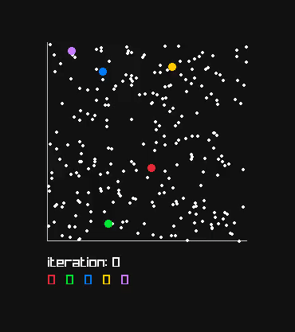

# K-means Visualizer
This project is coded to learn the k-means algorithm.



A matrix containing elements in random positions is created according to the `DOT_COUNT`
value given in the code. Then, centers are assigned to random locations according to
the CLUSTER_COUNT value, and then the distance to the centers is calculated for
each element and the element is added to the group of the closest center.
Each center is updated again to be the average of its elements, and this cycle
continues until you press the `n` key.

This project only depends on [Raylib](https://www.raylib.com/) (located on `./raylib-5.0`) for creating graphics.

It has hot-reload feature for development. All logics and drawing jobs in
`plugin.c` file. `main.c` file only load `libplugin.so` file using dynamic library
functions and create window.

**Table of Contents**:

- [setup](#setup-code)
  - [install](#install-source-code)
  - [run](#run-code)
- [structure of project](#structure-of-project)
- [development](#development)
- [contributing](#contributing)
- [license](#license)

> [!WARNING]
> This is experimental project, **DO NOT USE** in prod!

## Setup Code

### Install
Clone this project using GIT

```bash
git clone git@github.com:saracalihan/k-means
```

Go into directory

```bash
cd k-means
```

Now, you **have to compile raylib**. Please read [raylib readme](./raylib-5.0/README.md).

After the compile of reylib,

Compile all source code:

```bash
make
```

This command compile and link main executable and libplugin.

### Run Code

Run main executable:
```bash
./build/main
```

## Structure of Project

```bash
.
├── build            # all shared objects and executables here
│   ├── libplugin.so
│   ├── main
│   └── plugin.o
├── LICENSE
├── makefile
├── README.md
├── resources        # Resources like fonts, icons, ...
└── src              # Source codes and headers
    ├── config.h     # Main config file
    ├── hotreload.c
    ├── main.c       # Setup screen here
    ├── plugin.c     # Code here
    └── plugin.h     # Design shared statets
```

## Development
If you have only made improvements related to drawing,
run the following command while the `main` executable is running:

A new thread is created in the `main.c` file and this thread listens to
all files under the `src` folder and runs the `make hotreload` command
in case of any changes (save, update or delete) so that when you update
the code, it is automatically compiled. If the **build** is **successful**,
you will see a **green** notification in the lower left corner of the screen
else  you will see **red** notification.


You can turn this feature off and on from the `src/config.h` file and
determine which files will excluded in this feature.

Then press the `r` key in the user interface. When you press the `r` key,
the current application data (memory, variables, etc.) is kept in the
`Plugin` struct and `libplugin.so` is reopened and the values are restored.

## Contributing
This project accepts the open source and free software mentality in its main terms.
Development and distribution are free within the framework of the rules specified
in the license section, BUT the course and mentality of the project depends entirely
on my discretion.

**Please respect this mentality and contributing rules**

## License
This projct is under the [GNU GENERAL PUBLIC LICENSE](./LICENSE).
